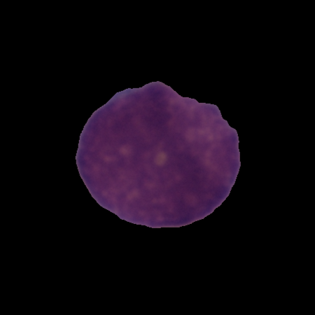

<h2> Leukemia Classification with CNN</h2>

<hr>

<h3> 1. What is Leukemia ? </h3>

<p style="font-size:16px"> Leukemia is cancer of the body's blood-forming tissues, including the bone marrow and the lymphatic system. </p>

<p style="font-size:16px"> Many types of leukemia exist. Some forms of leukemia are more common in children. Other forms of leukemia occur mostly in adults. </p>
    
<p style="font-size:16px"> Leukemia usually involves the white blood cells. </p>

<p style="font-size:16px"> Your white blood cells are potent infection fighters — they normally grow and divide in an orderly way, as your body needs them. </p>
    
<p style="font-size:16px"> But in people with leukemia, the bone marrow produces an excessive amount of abnormal white blood cells, which don't function properly. </p>

<p style="font-size:16px"> Complete blood count (CBC): This blood test gives details about red blood cells, white blood cells and platelets. </p>
    
<p style="font-size:16px"> If you have leukemia you will have lower than normal counts of red blood cells and platelets, and higher than normal counts of white blood cells. </p>

<hr>

<hr>

<h3> 2. Data Exploration </h3>

<p style="font-size:16px">The Cancer Imaging Archive (TCIA) Public Access - 17 Feb 2021</p>


<a href="https://wiki.cancerimagingarchive.net/display/Public/C_NMC_2019+Dataset%3A+ALL+Challenge+dataset+of+ISBI+2019">https://wiki.cancerimagingarchive.net/display/Public/C_NMC_2019+Dataset%3A+ALL+Challenge+dataset+of+ISBI+2019</a>

<hr>

<hr>

<h3> 2.1 Labels </h3>
    <ul style="font-size:16px">
        <li>ALL (0) Has cancer =>  7272 sample</li>
        <li>HEM (1) No cancer =>  3389 sample</li>  
    </ul>
    
<p style="font-size:16px">Total = 10661 Sample</p>

<hr>

<hr>

<h3> 2.2 Data Distribution </h3>


     
<hr>

<hr>
<h3> 2.3 Example Data </h3>

<p style="font-size:16px"> Blood cell examination.</p>

<p style="font-size:16px">A drop of blood is smeared on a microscope slide and examined for immature cells or cells with abnormal sizes, shapes or appearance compared to normal cells. </p>

<table>
  <thead>
  <tr>
     <td style="text-align:center">ALL</td>
     <td style="text-align:center">HEM</td>
     <td style="text-align:center">ALL</td>
     <td style="text-align:center">HEM</td>
  </tr>
  </thead>
  <tr>
    <td></td>
    <td></td>
    <td></td>
    <td></td>
  </tr>
</table>

<hr>

<hr>

<h3> 3. Steps </h3>
<h3> 3.1 Data Pre-processing </h3>
    <ul style="font-size:16px">
        <li>Fetch the data.</li>
        <li>Resize the images according to the model input.</li>
        <li>Load the data into matrixes.</li>
        <li>Normalization => The RGB channel values are between [0, 255]. Used a Rescaling Layer to standardize values to be in the [0, 1] range.</li>
        <li>Balanced the unbalanced weights.</li>
        <li>Split the data into test and train (20% / 80%).</li>
    </ul>
    
<hr>

<hr>

<h3> 3.2 Model </h3>

<h3> 3.2.1 Convolutional Neural Network </h3>

<p style="font-size:16px"> CNN's are really effective for image classification as the concept of dimensionality reduction suits the huge number of parameters in an image. This write-up barely scratched the surface of CNNs here but provides a basic intuition on the above-stated fact. </p>

<hr>

<hr>

<h3> 3.2.2 InceptionV3 Architecture </h3>

<h4> With 24M Parameters </h4>


<hr>

<hr>

<h3> 3.2.3 VGG19 Architecture </h3>

<h4> With 29M Parameters </h4>


<hr>

<hr>

<h3> 3.2.4 Fine Tuning </h3>

<p style="font-size:16px">Fine-tuning is applied because of the limited size of data.</p>

<p style="font-size:16px">ImageNet dataset is used to train freezed layers.</p>

<p style="font-size:16px">Pre-trained Inception Model Architecture is provided by TF-Hub:</p>

<a style="font-size:16px" href="https://tfhub.dev/google/tf2-preview/inception_v3/feature_vector/4">https://tfhub.dev/google/tf2-preview/inception_v3/feature_vector/4</a>


<hr>

<hr>

<h3> 4. Results </h3>

<table style="border: 1px solid black;text-align:center;width:100%;height:100%">
  <tr style="border: 1px solid black;text-align:center;">
    <th style="border: 1px solid black;text-align:center;">Model</th>
    <th style="border: 1px solid black;text-align:center;">Accuracy</th> 
    <th style="border: 1px solid black;text-align:center;" >Validation Accuracy</th>
  </tr>
  <tr style="border: 1px solid black;text-align:center;">
    <td style="border: 1px solid black;text-align:center;">Inception V3</td>
    <td style="border: 1px solid black;text-align:center;">0.83</td> 
    <td style="border: 1px solid black;text-align:center;">0.87</td>
  </tr>
  <tr style="border: 1px solid black;text-align:center;">
    <td style="border: 1px solid black;text-align:center;">VGG19</td>
    <td style="border: 1px solid black;text-align:center;">0.80</td> 
    <td style="border: 1px solid black;text-align:center;">0.82</td>
  </tr>
</table>


<hr>

<h3> 4.1 Graphs </h3>

<table>
  <thead>
  <tr>
     <td style="text-align:center;font-weight: bold; font-size:15px">VGG19</td>
     <td style="text-align:center;font-weight: bold; font-size:15px">Inception V3</td>
  </tr>
  </thead>
  <tr>
    <td></td>
    <td></td>
  </tr>
  <tr>
    <td></td>
    <td></td>
  </tr>
  <tr>
    <td></td>
    <td></td>
  </tr>
</table>

<hr>

<hr>

<h3> 5. Challenges </h3>
    <ul style="font-size:16px">
        <li>Bad prediction on HEM.</li>
        <li>Limited data.</li>
    </ul>
    
<hr>


```python

```
